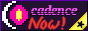
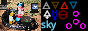

+++
title = "Links"
description = "Outlinks to other pages."
+++

If you have a site where you have a page similar to this one and want to include this website, wrap the SVG button an `<a>` element that links somewhere here. I have no preference as to whether you include the animation code.

<svg viewBox="0 0 456 128" width="88" height="31" xmlns="http://www.w3.org/2000/svg" fill="none" stroke="white" stroke-width="8px" style="box-sizing: border-box; background: linear-gradient(90deg, #103070, #4b1919, #8a0f61, #4b2060, #937, #103070) repeat; background-size: 200% 200%; padding: 4px; animation: ethamck-88-31 3s linear infinite;">
	<path d="M354 128V85c0-20-34-24-44-6m2 50V84c0-20-34-24-44-6m0 50V69Zm-9 0V84c0-20-30-21-46-11m46 16c-45 0-51 20-39 32 7 7 33 7 39-13m-92 20V22Zm0-52c11-15 38-12 38 8v44m-75-93v76c0 17 22 17 36 9m243 1c-57 27-65-70 0-52m10 59V22Zm36-64-32 26 33 38m-356-28L88 88m0-48 12-12M16 64h16M0 0l64 64M0 128l64-64m104 0H64M96 0C64 0 64 64 64 64s0 64 32 64"/>
	<style>
		@media (prefers-reduced-motion: no-preference) {
			@keyframes ethamck-88-31 {
				from {background-position: 0% 50%;}
				to {background-position: -200% 50%;}
			}
		}
	</style>
</svg>

```svg
<svg viewBox="0 0 456 128" width="88" height="31" xmlns="http://www.w3.org/2000/svg" fill="none" stroke="white" stroke-width="8px" style="box-sizing: border-box; background: linear-gradient(90deg, #103070, #4b1919, #8a0f61, #4b2060, #937, #103070) repeat; background-size: 200% 200%; padding: 4px; animation: ethamck-88-31 3s linear infinite;">
	<path d="M354 128V85c0-20-34-24-44-6m2 50V84c0-20-34-24-44-6m0 50V69Zm-9 0V84c0-20-30-21-46-11m46 16c-45 0-51 20-39 32 7 7 33 7 39-13m-92 20V22Zm0-52c11-15 38-12 38 8v44m-75-93v76c0 17 22 17 36 9m243 1c-57 27-65-70 0-52m10 59V22Zm36-64-32 26 33 38m-356-28L88 88m0-48 12-12M16 64h16M0 0l64 64M0 128l64-64m104 0H64M96 0C64 0 64 64 64 64s0 64 32 64"/>
	<style>
		@media (prefers-reduced-motion: no-preference) {
			@keyframes ethamck-88-31 {
				from {background-position: 0% 50%;}
				to {background-position: -200% 50%;}
			}
		}
	</style>
</svg>
```

It's 868 bytes with whitespace. You can get it down to about one hundred less with minification and [SVGO](https://svgomg.net), or another hundred less with no animation code.

You may want to add a `<title>` element with alt text under `<svg>` if you can't use `aria-label` on `<a>`. I don't predefine alt text for this button.

This is my collection of websites I've seen and admire both in design and content, roughly ordered by how many columns they fill up here and how attached I am to them. The third column is a link to their page of links, which is intentionally more vast than mine. You can find many more links in [my blogroll](/blogroll.json) which are more focused on content than design.

| | | |
|-|-|-|
| [](https://wiby.me/about/wiby.gif) | [wiby.me](https://wiby.me/) | |
| [](https://tilde.club/~zarate/tildeclub.gif) | [tilde.club](https://tilde.club/) | [users](https://tilde.club/users), [~harper webring](http://tilde.club/~harper/link.html?action=random) |
| [](https://cadence.moe/static/img/cadence_now.png) | [cadence.moe](https://cadence.moe) | [/links](https://cadence.moe/links) |
| | [artemislena.eu](https://artemislena.eu) | [Webrings](https://artemislena.eu/webring.html) |
| [](https://larbs.xyz/pix/larbs.gif) | [lukesmith.xyz](https://lukesmith.xyz) | |
| [](https://cobra.vern.cc/media/buttons/cobra.png) | [cobra.vern.cc](https://cobra.vern.cc) | [/sites](https://cobra.vern.cc/sites), [Bring](https://webring.crumpetalpaca.eu.org) |
| [](https://notnite.com/buttons/navigator.gif) | [notnite.com/blog](https://notnite.com/blog) | [notnite.com](https://notnite.com) |
| | [libdb.so](https://libdb.so) | [acmFriends](https://libdb.so/acmfriends-webring) |
| | [anhvn](https://anhvn.com) | |
| | [celeste.exposed](https://celeste.exposed) | |

<h2>See also</h2><!-- remove from table of contents -->

- [personalsit.es](https://personalsit.es)
- [ooh.directory](https://ooh.directory)
- [The Big List of Personal Websites](http://biglist.terraaeon.com)
- [whimsical.club](https://whimsical.club)
- [IndieWeb's list of webrings](https://indieweb.org/webring#Examples)

<aside>The views expressed on any linked pages are not unconditionally my own.</aside>
